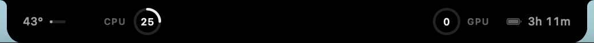

# Bubble 🫧

A tiny, pure-black system monitor that wraps around your MacBook's camera.



Temperature and CPU on the left of the camera, GPU and battery time on the right.

## Install

Requires macOS 14+ and the Xcode Command Line Tools (`xcode-select --install`).

```bash
git clone https://github.com/Vasiniks/bubble.git
cd bubble
./build.sh install
```

This builds Bubble, copies it to `/Applications` and launches it. Run the same command again to update.

To start Bubble automatically, click it and turn on **Launch at login**.

**Uninstall:** right-click Bubble → **Quit Bubble**, then delete `/Applications/Bubble.app`.

## Use

| Action | Result |
| --- | --- |
| **⌃⌥⌘B** | Expand / collapse |
| Click | Preferences |
| Right-click | Preferences… / Quit Bubble |

**Collapsed:** CPU temperature · CPU load | camera | GPU load · battery time remaining.

**Expanded:** the same shape grows wider to show CPU (user/system), GPU, memory, temperature, network, power draw, battery % and time remaining.

**Preferences:** launch at login, refresh rate, which extras show in the collapsed view, and which display to use. On displays without a notch, Bubble sits at the top center.

A metric that can't be read shows `—`.

## Lightweight

About 0.1% CPU and 14 MB of memory at idle. No dependencies, no background processes, no Accessibility permission.

- One low-priority timer, paused while the display sleeps.
- Memory, power and network are only read while expanded.
- Battery updates only when macOS reports a change.

Metrics come from native APIs: Mach host statistics (CPU, memory), IOKit (GPU, power, battery), IOHID sensors (temperature, Apple Silicon only), and `sysctl` (network).

## Development

```bash
./build.sh        # build Bubble.app in the repo
./build.sh run    # build and launch it from the repo
```

## License

MIT
